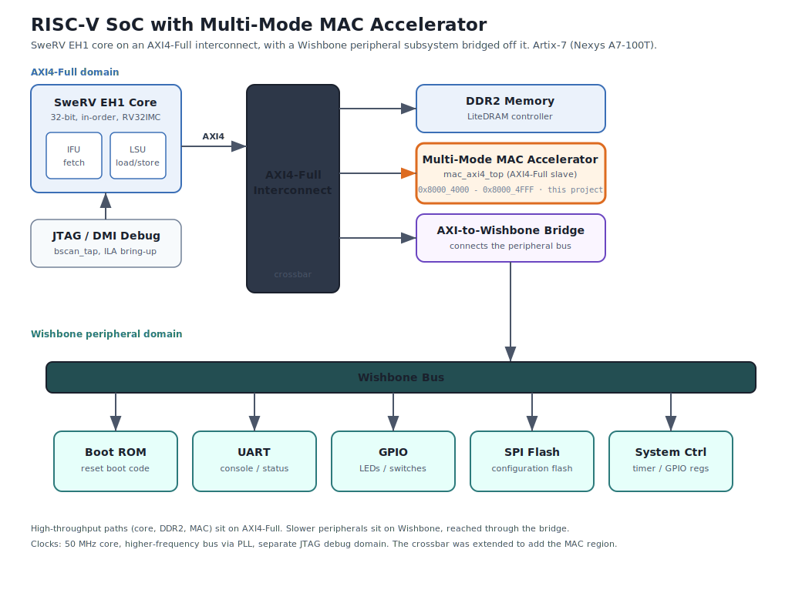
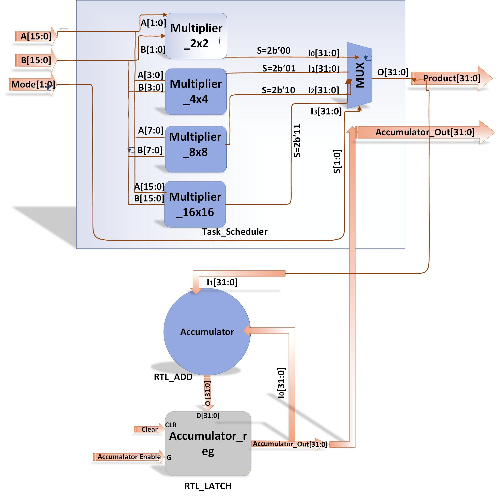
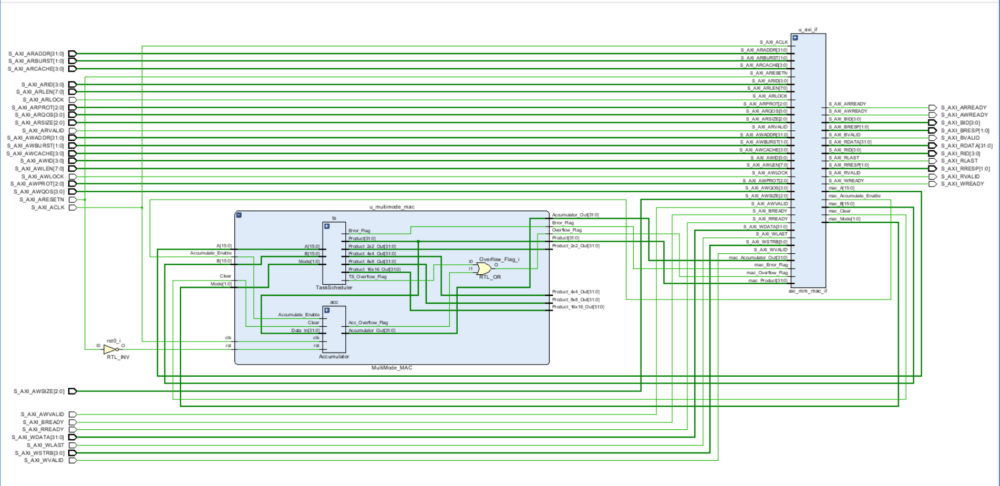
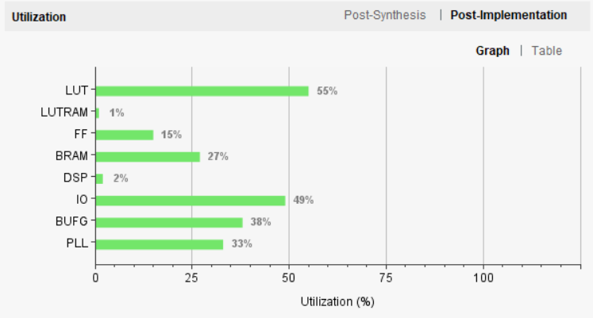
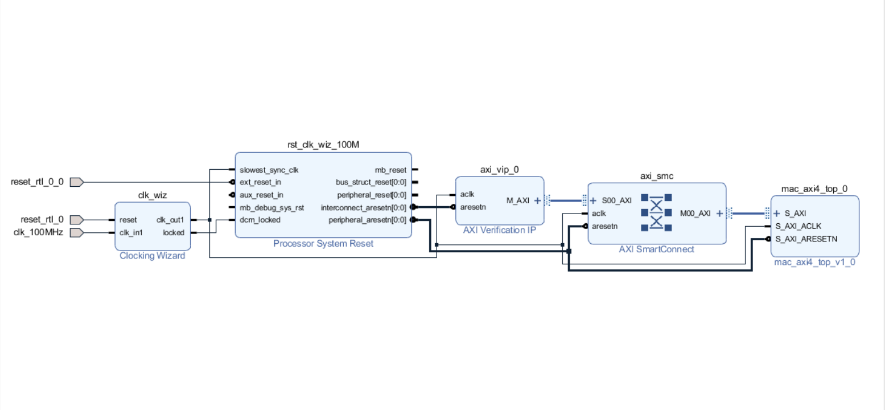

# Multi-Mode MAC Accelerator for a RISC-V SoC

A configurable-precision Multiply-Accumulate (MAC) hardware accelerator, written from scratch in Verilog, wrapped in a custom AXI4-Full slave interface, and integrated as a peripheral onto a SweRV EH1 RISC-V core running on a Xilinx Artix-7 FPGA (Nexys A7-100T).


---

## What is this, in plain terms

Almost every chip that does signal processing, AI, or audio and image work spends most of its time doing one operation: multiply two numbers and add the result to a running total. That is a MAC.

This project is a small, custom-built hardware block that does exactly that, with one extra trick: it can multiply numbers of four different sizes (2-bit, 4-bit, 8-bit, and 16-bit) under software control, so a program can pick the right precision for the job. It then plugs into a real RISC-V processor as a peripheral, so software running on the CPU can hand it numbers and read back the answer over a standard industry bus (AXI4). The whole thing was built in Verilog, verified in simulation, and run on a physical FPGA board.

It demonstrates the full digital design flow end to end: specification, RTL design, functional verification, bus interfacing, SoC integration, FPGA implementation, and on-board bring-up.

---

## System architecture



This is a complete SoC. The MAC accelerator is mapped as an AXI4-Full slave on the interconnect of a SweRV EH1 RISC-V system, alongside the DDR2 main memory. The slower peripherals (boot ROM, UART, GPIO, SPI flash, and a system controller) sit on a Wishbone bus, reached from the AXI side through an AXI-to-Wishbone bridge. So the high-throughput paths use AXI4-Full while the legacy peripherals use Wishbone. Software running on the core configures the accelerator and reads results through memory-mapped registers.

---

## The MAC unit



The MAC has three parts. A **Task Scheduler** routes the two operands to the multiplier selected by the 2-bit Mode input and presents a uniform 32-bit product. Four **multipliers** (2x2, 4x4, 8x8, 16x16) are built hierarchically, each larger one assembled from four of the next smaller. An **accumulator** adds each product into a running 32-bit total, with synchronous clear and saturation on overflow.

---

## Key features

- **Four precision modes** selectable at runtime: 2x2, 4x4, 8x8, and 16x16, producing 4, 8, 16, and 32-bit products respectively.
- **Hierarchical multiplier design.** The 16x16 is built from four 8x8 blocks, each from four 4x4 blocks, each from four 2x2 blocks, down to AND-gate partial products. Partial sums use ripple-carry and carry-lookahead adders with binary-to-excess-1 logic.
- **32-bit accumulator** with synchronous clear, a one-cycle-pulse accumulate enable (so each enable adds exactly once), and unsigned saturation with an overflow flag.
- **Custom AXI4-Full slave wrapper** written from scratch, with independent read and write state machines, burst-read support, byte-strobe writes, and ID tagging. No vendor IP generator was used for the bus logic.
- **SoC integration.** Mapped into the AXI crossbar of a SweRV EH1 RISC-V system and accessed from C software through memory-mapped registers.
- **Implemented and run on hardware** (Nexys A7-100T), not simulation only.

---

## Results

All figures are from Xilinx Vivado 2018.2 targeting the Artix-7 `xc7a100t`.

### Functional verification

The design was verified in simulation across every mode and every accumulator function. Each result matched the expected value.

| Operation | Example | Expected | Result |
|---|---|---|---|
| 2x2 multiply | 3 x 2 | 6 | match |
| 4x4 multiply | 15 x 10 | 0x96 | match |
| 8x8 multiply | 255 x 255 | 0xFE01 | match |
| 16x16 multiply | 65535 x 65535 | 0xFFFE0001 | match |
| Accumulate | single and multi-event | running sum | match |
| Clear | reset to zero | 0 | match |
| Saturation | overflow case | 0xFFFFFFFF | match |
| Register stability | write/read 0xCAFEBABE | 0xCAFEBABE | match |

### Elaborated RTL



The MAC core (Task Scheduler plus Accumulator) wired into the custom AXI4-Full slave interface.

### FPGA resource utilisation



| Block | LUTs | Flip-flops | DSP |
|---|---|---|---|
| MAC core + AXI4-Full wrapper (standalone) | 216 (0.34%) | 64 (0.05%) | ~2 |
| Full SoC (SweRV EH1 + peripherals + MAC) | 35,083 (55.3%) | 19,190 (15.1%) | ~2% |

The accelerator adds roughly 0.34% of device LUTs, leaving the rest of the fabric free.

### Timing and power

- Meets the 50 MHz core-clock setup target with a positive worst negative slack of +1.064 ns (longest path completes in under one clock period).
- Total on-chip power for the full SoC estimated at 0.927 W (0.818 W dynamic, 0.109 W static). The MAC itself contributes a small fraction; the budget is dominated by I/O and clocking for the DDR and JTAG infrastructure.

---

## How software uses it

The CPU talks to the accelerator through memory-mapped registers over AXI4-Full:

| Offset | Register | Access | Purpose |
|---|---|---|---|
| 0x00 | CONTROL | RW | Scratch / control word |
| 0x04 | STATUS | R | Error and overflow flags |
| 0x08 | OPERAND_A | RW | First operand |
| 0x0C | OPERAND_B | RW | Second operand |
| 0x10 | MODE | RW | Precision mode select |
| 0x14 | ACCUM_EN | RW | Pulse to accumulate the latest product |
| 0x18 | CLEAR_ACC | RW | Clear the accumulator |
| 0x1C | PRODUCT | R | Latest product |
| 0x20 | ACC_VALUE | R | Accumulated total |

A typical sequence: write A and B, set MODE, read PRODUCT, then pulse ACCUM_EN and read ACC_VALUE to accumulate.

---

## Repository structure

```
.
├── rtl/                                # Multi-Mode MAC core (original work)
│   ├── MultiMode_MAC.v                 # Top-level MAC core
│   ├── TaskScheduler.v                 # Mode-based routing and output mux
│   ├── Accumulator.v                   # 32-bit accumulator with saturation
│   ├── Multiplier_2x2.v                # Base multiplier
│   ├── Multiplier_4x4.v
│   ├── Multiplier_8x8.v
│   ├── Multiplier_16x16.v
│   ├── Partial_Product_Generator_2x2.v
│   ├── RCA_BEC_Adder.v                 # Ripple-carry + BEC adder
│   ├── CLA.v                           # Carry-lookahead adder
│   └── CLA_BEC_Unit.v                  # CLA + BEC adder
├── axi/                                # AXI4-Full slave interface (original work)
│   ├── axi_mm_mac_if.v                 # Register interface and read/write FSMs
│   └── mac_axi4_top.v                  # AXI wrapper + MAC instance
├── soc-integration/
│   └── README.md                       # How the MAC was added to the SweRV SoC
└── docs/
    ├── soc_architecture.svg
    ├── block_diagram.jpg
    ├── rtl_schematic.png
    ├── vivado_block_design.png
    └── fpga_utilization.png
```

---

## SoC integration



The MAC was added as a third AXI slave to the crossbar of a SweRV EH1 system. The crossbar slave count was raised from two to three, the address map was extended with the MAC region (`0x8000_4000`), and the request and response arrays were widened by one element. The third-party SoC sources (SweRV core, crossbar, DRAM controller) are not redistributed here. See `soc-integration/README.md` for the exact files modified and a link to the upstream RVfpga / SweRV project.

---

## Skills demonstrated

RTL design (Verilog, SystemVerilog) · digital arithmetic (hierarchical multipliers, carry-lookahead and carry-select adders) · AXI4-Full slave design from scratch · clock and reset handling · functional verification · RISC-V SoC integration · AXI crossbar / interconnect modification · FPGA implementation on Xilinx Artix-7 · Vivado synthesis, place-and-route, timing, power, and utilisation analysis · memory-mapped peripheral and C driver bring-up · JTAG, ILA, and UART hardware debug.

---

## Roadmap

Planned directions for the next revision:

- **Per-mode clock gating and operand isolation**, so the runtime precision selection translates into measurable dynamic-power savings on the inactive datapaths.
- **Datapath reuse across modes** by exposing the sub-products already present inside the 16x16 hierarchy, for a smaller area footprint.
- **A native 32-bit AXI data path** (or explicit byte-lane steering) for direct integration without relying on bus width conversion.
- **A streaming / DMA front end**, letting the accelerator process whole vectors autonomously to target convolution and dot-product workloads.


---

## Authors

Junaid Khalid — Design / FPGA / Verification Engineer · GitHub: [@Engrr2025](https://github.com/Engrr2025)

Ahsan Abbas Kazmi - Co-author

Final Year Project, Department of Electrical and Computer Engineering, COMSATS University Islamabad (Wah Campus), 2025. Supervised by Engr. Muhammad Ali and Prof. Dr. Nadia Nawaz Qadri.

## Acknowledgements

Integrated onto the SweRV EH1 core and the RVfpga / Nexys reference SoC from the Chips Alliance / Western Digital ecosystem, used under their respective licenses.
